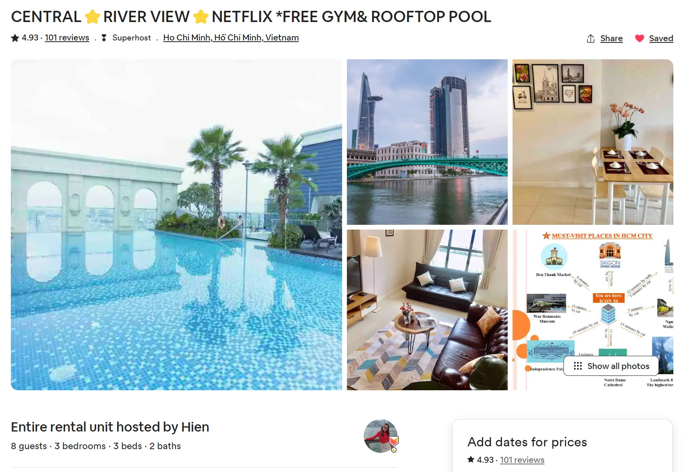

> 친한 형들과 술 한 잔 걸친 어느날 누군가 이야기를 꺼냈다.
> "우리 여행이나 가자."
> "어디?"
> "베트남?"
> "하노이는 갔다 왔어."
> "그럼 호치민 어때?"
> 이렇게 우리들의 여행은 시작되었다.

## 처음에는 무계획으로
호치민 여행을 준비하기 시작한 것은 9~10월 정도였다. 호치민을 계획하게 된 것도 편하게 갈만한 여행지를 고르다 보니 베트남이었고, 멤버 중 한 명이 하노이는 갔다 왔으니 그러면 호치민이지 이렇게 특별한 생각 없이 정하게 되었다.(남자 셋이 나트랑이나 다낭을 가기에는 너무 휴양지 느낌이었다.)

심지어 너무 바빠서 호치민이 어떤 도시인지도 모르는 채로 비행기 티켓도 구매하였다. 5박6일로.... 후에 알게 된 것은 호치민은 볼 거리가 많이 없는 도시여서 그렇게 길게 가지 않는다고 하는 것이었다. 

## 슬슬 계획을 세워볼까?
본격적으로 준비를 하게 된 것은 1월이 다 되어서였다. 여행은 2월이었으니 조금은 닥쳐서 한 감도 없지 않지만 지금 와서 생각해보면 적절했던 것 같다. 우리가 미리 준비한 것은 항공권과 숙소 두 가지였다. 우리는 이 두 가지에 맞춰 여행 계획을 세우고 투어를 예약했다. 5박6일이라는 너무 큰 도화지를 채워야 했기에 고민도 많았지만 여행이 끝난 지금 5박 6일도 조금 아쉬운 느낌까지 있다. 

## 말도 많고 탈도 많은 비엣젯 항공
우리가 예약한 항공사는 비엣젯이었다. 만약 베트남 여행을 준비하고 있는 사람이라면 비엣젯 항공은 피할 것을 권하고 싶다. 하지만 가격적인 메리트 등으로 비엣젯을 선택해야 한다면 다음의 몇 가지 사항을 주의하기 바란다.

### 첫번째, 환불이 어렵다.
비엣젯을 예약하는 방법은 보통 두 가지이다. 하나는 비엣젯 항공사에서 직접 예약하는 것이고, 둘째는 `TRIP.COM`과 같은 대행 사이트를 이용하는 것이다. 둘 다 환불이 어렵기는 하지만 비엣젯 항공에서 환불 하는 경우 현금으로 환불이 되지 않고, 바우쳐로 환불된다니 주의해야 한다.

우리는 TRIP.COM을 이용하였는데 이 경우에도 조심해야할 것들 천지이다. 이 사이트에서 혜택이라고 하는 것들은 왠만하면 다 무시하도록 하자. 환불도 어렵고, 낚시성인 것들이 대부분이다. 예를 들어 `요금잠그미`기능은 일정 요금을 미리 내고 낮은 금액을 보장받는 것인데 막상 결제를 하고 나면 취소가 되지 않는다. 심지어 후에 환불 받을 때는 환불도 되지 않는다. 그나마 `환불보장`기능 정도는 쓸 만하다. 환불 보장 기능은 조금 비싼 돈을 내고, 환불 수수료를 면제 받는 기능이다. 이 때, 환불을 현금으로 받을 수 있기 때문에 비엣젯 항공을 사용할 경우 하는 편이 나을 것이다. 
![환불내역]
우리가 더욱 어이 없었던 상황은 우리가 일정변경을 필요로 할 때였다. Trip.com 에는 항공권 변경 탭이 있다. 하지만 변경 수수료가 정말 어이없게 붙었던 것이다. 이것이 비엣젯 항공이어서인지 Trip.com이 문제인지는 알 수 없다. 항공권이 총 150만원 정도 였음을 생각할 때, 350만원은 말도 안되는 변경 수수료이다.
![변경수수료]

*** 결론: 돈만 있다면 좋은 항공사를 선택하자!***

### 두번째, 자리가 비좁다.
비엣젯 항공은 저가 항공사 답게 자리가 매우 비좁다. 하지만 이 경우에 해결 방법이 있다. 이는 추가 금액을 지불하고, 넓은 좌석을 예매하는 것이다. 비엣젯 항공사에서 직접 예매하지 않고, Trip.com 등에서 항공권을 예매한 경우 반드시 출국 전에 [비엣젯 항공사 홈페이지](https://www.vietjetair.com)에서 좌석과 기내식 등 필요한 것을 추가로 예약해야 한다. 
* 먼저 홈페이지에 들어가서 우측 상단의 `MY BOOKING`을 누르고, 예약번호와 이름을 넣는다.
* 다음으로 좌석을 선택하면 되는데, 파란색의 넓은 좌석을 선택하면 된다.
* 이 때, 기내식도 선택하면 된다.

### 세번째, 홈페이지가 엉망이다.
이 내용은 위의 두번째 항목과 연관된다. 홈페이지에서 좌석과 기내식을 선택하고 나면 이를 결제해야 하는데, 결제가 안된다는 것이다. 이유는 정확히 모르지만, 결제를 할 때 기본적으로 영문 사이트로 선택한 다음에 하는 것이 좋다. 만약 그래도 안된다면 구글 검색을 활용하자.

## 숙소는 어떤 곳이 좋을까?
항공권 예약을 어렵사리 완료했다면 다음으로 해야할 일은 숙소다. 호치민은 서울보다 3배 이상 크고 우리나라의 구 처럼 지역이 1~7군 이런 식으로 나누어져 있다. 하지만 대부분의 관광지는 1군에 몰려 있다고 해도 과언이 아니다. 따라서 숙소를 잡을 때, 1군 또는 그 근처에 있는 호텔을 예약하면 된다. 다만 주의할 지역이 있다면 부이비엔(또는 워킹스트리트) 지역이다. 이 지역은 길거리에 노상 클럽이 밀집한 거리로 한 번정도 놀러가기에는 좋지만 거리 자체가 클럽 그 자체이다 보니 매우 시끄럽다. 따라서 이 근처에 있는 숙소라면 피하는 것이 좋을 것이다. 

우리는 4군의 바로 1군과 인접한 `icon 56`이라는 숙소를 `airbnb`를 통해서 예약하였다. 아파트와 호텔 중간 정도의 형태로 우리가 예약한 객실은 3개의 개인 방이 있어서 우리에게 딱이었다. 그리고 리버뷰여서 바로 메콩강이 보이기까지 했다. (아래 사진을 누르면 예약 페이지로 연결된다.)

## 스프레드시트로 여행 계획을 세우자!
여행 계획을 세우는 방법은 사람마다 다 다를 것이다. 나 같은 경우에 이번에는 구글 스프레드시트를 활용하였다. 스프레드시트의 장점은 공유가 편리하고 링크를 걸기 쉽다는 점이다. 그래서 이번 여행을 할 때, 미리 가고 싶은 음식점들이나 장소들의 구글 링크를 모두 저장해두고 간단한 위치 정보나 특징을 적어 두어 활용하였다. 그리고 구글 지도에서 검색한 경로 자체를 링크로 삽입할 수 있어서 매우 편리하다.

다음은 이번 여행 계획을 세워 둔 것 스프레드 시트이니 참고하기 바란다.
[여행계획 예시 공유](https://docs.google.com/spreadsheets/d/1XhdPFRZ2x-GU6cHMgnF2E2ngoH-WvxWmaWy3kU3gBDo/edit?usp=sharing)
(이를 재활용하려면 [파일]-[사본만들기]를 활용하자.)

## 호치민에서는 어디를 가야할까?
호치민을 여행할 때, 우리가 염두할 만한 부분은 다음과 같다.
1. 관광지
2. 먹거리
3. 투어
4. 쇼핑

### 1. 관광지
#### 1군은 무엇이 있을까?
앞서 언급했듯 호치민에서 관광지로 가볼 만한 곳은 1군에 대부분이 있다. 따라서 짧은 기간 동안 호치민을 다녀온다면 1군에 있는 다음의 관광지를 돌아보는 것만으로도 만족할 것이다. 

*** 1군 관광지 목록 ***
* 벤탄시장
* 부이비엔(워킹스트리트)
* 통일궁
* 시립미술관
* 시립박물관
* 노트르담 대성당
* 중앙우체국
* 시립극장
* 호치민 시청
* 랜드마크81(야경)
* 핑크성당(떤딘 성당)

[호치민 시티 투어 후기]()
 
#### 2군은 무엇이 있을까?
만약 시간이 조금 더 있다면 2군(타오디엔) 지역도 돌아보는 것을 추천한다. 2군은 부유층이 사는 지역으로 볼거리가 많지는 않지만 예쁜 카페들과 맛있는(비싼) 음식점들 그리고 멋진 건물들이 즐비하다. 만약 2군을 가게 된다면 오가는 길에 메콩강을 가로지르는 워터버스를 이용해 보는 것도 좋을 것이다.

[호치민 2군, 타오디엔 여행 후기]()

### 2. 먹거리
호치민 여행에서 가장 중요한 부분은 바로 먹거리일 것이다. 호치민에서 먹어볼만한 음식들은 다음과 같다.

*** 호치민 먹거리 ***
* 쌀국수(Pho)
* 반미
* 분짜
* 반쎄오
* 껌땀
* 후띠우
* 분더우 맘똠
* 차오롱
* 해산물요리

[호치민 먹부림 여행 후기]()

### 3. 투어
호치민에서 할 수 있는 여러 투어가 있다. 시내 관광이라던가 야식 투어 등의 투어가 있지만 조금 시간적인 여유가 있는 경우에 많이 하는 투어는 다음과 같다.

*** 호치민 유명 투어 ***
* 호치민 구찌 터널 투어
* 무이네 사막 지프 투어

이 중에서 우리는 무이네 사막 투어를 다녀왔다. 구찌 터널은 재미있다는 평도 있었지만 무이네와 구찌 터널 둘다 거리가 꽤 있어서 구찌 터널의 경우 후일을 기약할 수 밖에 없었다. 하지만 무이네 사막 투어의 경우 매우 만족스러웠고, 호치민 여행을 계획하는 사람들의 경우 꼭 다녀오기를 추천한다. 

무이네의 경우 호치민과 나트랑의 중간 정도에 있는 해변 마을로 해변 모래로 인해 생긴 사막이 있어 이를 지프를 타고 관광하는 형태이다. (따라서 나트랑에서 무이네를 올 수도 있다.) 
[무이네 투어 후기]()

### 4. 쇼핑
호치민에는 많은 쇼핑센터가 있다. 이 중에서 여행객들이 가볼 만한 곳은 다음과 같이 분류할 수 있다.

*** 호치민 쇼핑 센터***
* 일반 시장(벤탄시장 등)
* 짝퉁 마켓(사이공스퀘어)
* 고급 쇼핑몰(타카시마야 백화점, 사이공센터센터, 빈콤센터 등)
* 대형 마켓(롯데마트 등)

우리는 벤탄 시장의 경우 처음에 환전을 위해서만 갔고, 지나가면서 별로 볼 것은 없었던 것으로 기억한다. 벤탄 시장 근처에도 짝퉁들을 많이 팔지만 만약 거대한 짝퉁 시장을 보고 싶다면 사이공스퀘어를 가본는 것을 추천한다. 

만약 고급 쇼핑몰에서 휴식도 즐기면서 쇼핑을 하고 싶다면 위에서 언급한 타카시마야나 사이공센터, 빈콤 센터를 가보는 것도 좋다. 다만 나이키나 아디다스 등의 경우 우리나라보다 더 비싼 편이었다. 

그리고 만약 기념품을 구매한다면 롯데마트와 같은 대형마켓을 활용하는 편이 좋다. 라탄 백 같은 경우에는 사이공 스퀘어에서 구매하였다. 

[호치민에서 기념품을 사자]()

