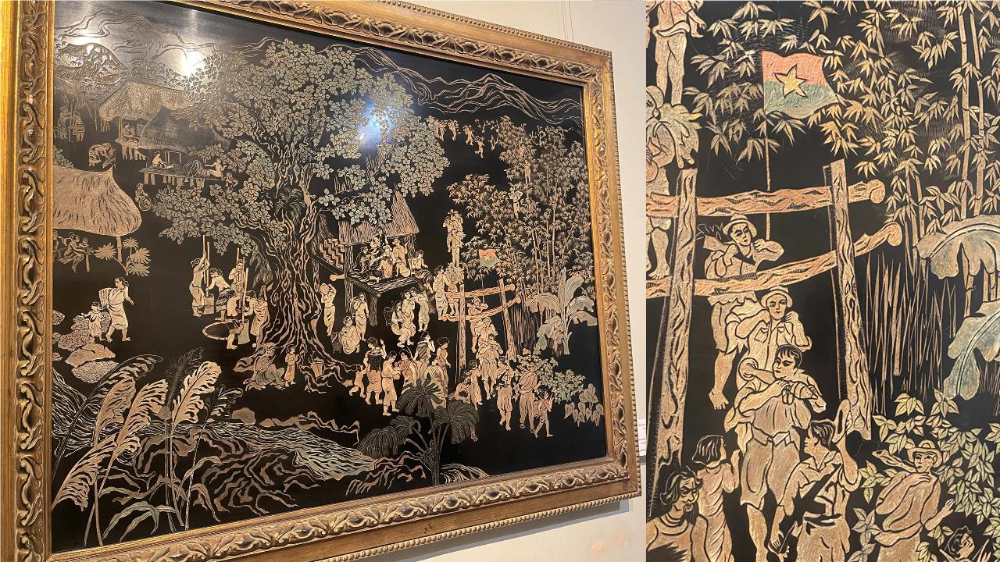

> 친한 형들과 술 한 잔 걸친 어느날 누군가 이야기를 꺼냈다.
> "우리 여행이나 가자."
> "어디?"
> "베트남?"
> "하노이는 갔다 왔어."
> "그럼 호치민 어때?"
> 이렇게 우리들의 여행은 시작되었다.

## 호치민 여행 2일차
호치민에서 첫날 밤을 보내고 본격적으로 여행이 시작된 것은 2일차였다. 우리의 목표는 호치민 시티 투어! 우리가 계획한 시티투어의 일정은 대략 다음과 같았다.
-  호치민 시립미술관
-  호치민 시립 박물관
-  통일궁
-  노트르담 대성당
-  중앙우체국
-  호치민시청
-  호치민 시립극장

하지만 이 중 우리는 시립미술관을 집중해서 보기로 하고 박물관은 패스하기로 하였다. 그리고 시청의 경우 지나가면서 건물만 보는 것으로 만족하였다. 

위의 지도에서 보는 것처럼 시티투어로 볼 만한 곳은 다 도는 일정에도 불구하고 한 시간이 안걸릴 정도이다. 물론 2월임에도 최고기온이 34도에 육박하니 더위에 약한 사람들은 시티투어 버스를 선택하는 것도 나쁘지 않을 것이다. 
 
## 시티투어1- 시립미술관
시립미술관은 사실 들어가서 관람할 계획은 없었고, 밖에서 보기만 할 계획이었다. 하지만 무슨 특별전을 열고 있고, 첫 방문지이다 보니 들어가서 직접 관람을 하게 되었다. 미술관에서는 베트남의 유명한 작가들이나 현대 미술 등을 전시하고 있었는데, 나름 볼만하였다. 베트남 전쟁과 관련된 내용들이 꽤나 있었고, 특히나 인상 깊었던 작품은 나무 등을 활용한 옻칠 작품이었다. 

시립미술관은 오래되고 낡은 건물이지만 아름다웠고, 작품들을 감상하면서 건물을 걷는 것도 나름 즐거운 일이었다. 중간 중간 현지인들이 사진을 찍거나 전시를 관람하고 있었고, 딱히 외국인 관광객들은 보이지 않았다. 
(추가 정보: 시립미술관에서 특별히 사진 촬영이 금지되지는 않았으니 참고하기 바란다.)

## 시티투어2 - 베트남 통일궁
다음 일정이었던 통일궁은 원래 베트남 전쟁 당시 남베트남의 대통령궁이었다. 원래 프랑스 식민지 시절 만들어진 이 건물은 베트남이 프랑스로 독립한 이우에는 독립궁으로  개명되었다가 쿠데타로 인해 파괴되어 철거 되었다가 1966년 재건되어 남베트남의 대통령 관저로 사용되었다고 한다. 이후 1975년 전쟁이 끝나고 베트남이 통일된 이후에는 통일을 기념하여 통일궁으로 개명되었고, 지금은 대통령궁 당시의 모습을 그대로 보존하여 박물관처럼 개방되었다. 물론 실제 외교행사 등에 사용되기도 한다고 한다. 
 
그 짧은 역사에도 불구하고 통일궁은 나름 매우 화려하게 꾸며져 있었다. 이러한 모습은 미국의 막강한 지원에도 불구하고 남베트남이 전쟁에 패배하였던 역사를 되짚어 보게 하였다. 하지만 이와 별개로 관광객에 입장에서 통일궁은 볼거리도 많고 꼭 구경할 만한 장소이다. 

건축물은 현대적으로 지어져 있어 화려하고 그 정원 또한 매우 잘 정돈되어 있다.
* 통일궁 전경

건물 내부 또한 매우 화려한 그림들로 장식되어 있다. 특히나 나무 위에 그려진 여러 작품들은 매우 인상 깊다.

* 통일궁 내부

* 통일궁 내부 장식

그 중 백미는 대통령과 가족들의 침실 가운데 위치한 실내 정원이다. 실내 정원은 건물 내부임에도 불구하고 햇빛이 들어오고 그 가운데는 작은 분수가 위치하고 있어 보는 이로 하여금 절로 감탄을 자아내게 한다. 

건물 투어의 마지막은 맨 꼭대기 층에 위치한 매점에서 끝이 난다. 매점에는 각종 음료수와 맥주, 그리고 기념품 등을 판매하는데 이 곳에서의 맥주 한 잔은 덥고 힘든 여행 중 하나의 오아시스라고 할 수 있다.

## 시티투어3 - 노트르담 대성당 & 중앙우체국 & 시립극장
노트르담 대성당과 중앙우체국은 통일궁과 거리상으로 500m 정도밖에 떨어져 있지 않다. 안타깝게도 대성당은 현재(2023년 2월 기준) 공사중이다. 외관을 볼 수 없고, 내부는 당연히 들어갈 수 없다. 그냥 '아 저게 대성당이구나' 하고 보고 지나가면 된다. 

사실 그것 보다 볼만한 것은 중앙우체국이다. 중앙우체국은 노트르담 대성당 바로 맞은편에 위치하고 있다. 

중앙 우체국 내부에 들어가면 세계 여러 나라의 시간을 나타내는 시계들이 눈에 우선 띈다. 그리고 중앙과 입구 좌우측으로 기념품을 파는 매대가 있다. 건물 안쪽의 가장자리로는 우체국 업무를 보고 있다. 

우리는 이곳에서 작은 술잔과 마그넷 등을 구매하였으니 참고하기 바란다.

* 호치민 중앙 우체국 내부

중앙 우체국에서 조금 걷다보면 시립 극장이 있다. 시립 극장에서는 각종 공연을 진행하지만 우리는 보지 않았다. 하지만 여행 중에 공연을 관람하는 것도 나쁘지 않은 선택일 것이다. 공연 이외에도 시립 극장은 건물 외관이 아름다워 한 번 들러 보는 것을 추천한다. 

## 시티투어4 - 길거리 여행
호치민 시내를 돌아다니면서 인상깊었던 것은 큰 나무들과 수많은 오토바이이다. 특히 겨울철 삭막한 한국의 풍경을 보다 울창한 나무를 보는 것은 겨울 호치민 여행의 또 다른 즐거움 중 하나 일 것이다. 

호치민의 사람들은 대부분 오토바이를 타고 다니는데 길거리를 횡단할 때 수많은 오토바이로 인해 어려움을 겪었다. 하지만 조금 뜸할 때 한차선씩 천천히 길을 건너면 어렵지 않게 건널 수 있고, 나중에 되면 길건너기 마스터가 되어 있을 것이다. 

